# Base de données

PostgreSQL 16. Schéma défini dans [docker/init_postgres.sql](https://github.com/benjsant/InfiniDex-IA/blob/main/docker/init_postgres.sql), modèles SQLAlchemy dans [backend/db/models/](https://github.com/benjsant/InfiniDex-IA/tree/main/backend/db/models). Pour la ref des classes ORM, voir [Modèles DB](reference/models.md).

## Tables principales

### Référentiels

| Table          | Contenu                                      | Volume |
| -------------- | -------------------------------------------- | ------ |
| `type`         | 18 types standard + 9 types triple-fusion (`is_triple_fusion_type`) | 27 |
| `ability`      | Talents (EN + FR + description)              | 178    |
| `move`         | Capacités (nom, type, puissance, PP, …)      | 659    |
| `generation`   | Générations (1–9)                            | 9      |
| `creator`      | Créateurs de sprites (attribution)           | 7 081  |

### Pokémon & évolutions

| Table                   | Contenu                                               |
| ----------------------- | ----------------------------------------------------- |
| `pokemon`               | 501 Pokémon IF + 71 formes = **572 entrées**          |
| `pokemon_type`          | Types primaires/secondaires (FK vers `type`)          |
| `pokemon_ability`       | Talents disponibles (normaux + cachés)                |
| `pokemon_move`          | Learnset : 40 067 lignes (level-up, TM, tutor, egg)   |
| `pokemon_evolution`     | Arbres d'évolution (pre + post)                       |
| `pokemon_location`      | Zones de capture IF                                   |
| `tm` + `tm_location`    | 121 CTs + 115 liaisons CT ↔ lieu (jonction N-N)       |

### Fusions

| Table              | Contenu                                                       |
| ------------------ | ------------------------------------------------------------- |
| `fusion_sprite`    | 166 090 sprites custom (head_id, body_id, variant, path, crédit) |
| `triple_fusion`    | 23 fusions triples reconnues                                  |
| `move_expert_move` | 65 règles Move Expert (Knot Island + Boon Island)             |
| `move_tutor`       | 41 Move Tutors classiques (NPC, prix, localisation)           |
| `item` + `item_location` | 70 items (fusion, évolution, valuable) + lieux d'obtention |
| `type_effectiveness` | 648 entrées (27 types × multiplicateurs 0/0.5/1/2)       |

## Focus : `move_expert_move`

Table atypique, introduite pour modéliser les Move Experts sans multiplier les tables de jonction.

```sql
CREATE TABLE move_expert_move (
    id                   SERIAL      PRIMARY KEY,
    move_id              INTEGER     NOT NULL REFERENCES move(id) ON DELETE CASCADE,
    expert_location      VARCHAR(20) NOT NULL CHECK (expert_location IN ('knot_island', 'boon_island')),
    required_pokemon_ids INTEGER[]   NOT NULL DEFAULT '{}',
    required_type_ids    INTEGER[]   NOT NULL DEFAULT '{}',
    required_move_ids    INTEGER[]   NOT NULL DEFAULT '{}'
);
```

Chaque ligne = une règle. Une fusion peut satisfaire plusieurs règles pour le même move (d'où la liste de `locations` dans la réponse API).

**Sémantique** (cf. [Règles de fusion](fusion-rules.md#move-experts)) :

- **Au sein d'une ligne** : AND entre axes (pokémon requis × types requis × moves requis).
- **Axe `required_pokemon_ids`** : OR — head OU body doit être dans la liste.
- **Axe `required_type_ids`** : superset — la fusion doit avoir **tous** les types listés.
- **Axe `required_move_ids`** : intersection — au moins un move en commun.
- **Tableau vide** sur un axe = aucune contrainte sur cet axe.
- **Entre lignes** : OR — une ligne suffit pour débloquer le move à cet emplacement.

## Index utiles

```sql
CREATE INDEX idx_pokemon_move_pokemon ON pokemon_move(pokemon_id);
CREATE INDEX idx_fusion_sprite_head ON fusion_sprite(head_id);
CREATE INDEX idx_fusion_sprite_body ON fusion_sprite(body_id);
CREATE INDEX idx_move_expert_location ON move_expert_move(expert_location);
```

## Conventions

- Noms EN : clé primaire de recherche (sources PokeAPI/wiki).
- Noms FR : colonne `name_fr` nullable (Poképédia, complétion progressive).
- `national_dex_id` : ID officiel PokeAPI (nullable pour les formes IF exclusives).
- Tous les `ON DELETE` utilisent `CASCADE` sur les jointures pour garder la cohérence si on regénère une table référentielle.

## ERD

Relations entre les tables principales. Les colonnes affichées sont les clés et contraintes structurantes ; pour le détail complet voir `init_postgres.sql`.

```mermaid
erDiagram
    generation {
        int  id PK
        str  name_en
        str  name_fr
    }
    type {
        int  id PK
        str  name_en
        str  name_fr
        bool is_triple_fusion_type
    }
    type_effectiveness {
        int   id PK
        int   attacking_type_id FK
        int   defending_type_id FK
        float multiplier
    }
    ability {
        int  id PK
        str  name_en
        str  name_fr
        str  description_en
        str  description_fr
    }
    move {
        int  id PK
        str  name_en
        str  name_fr
        int  type_id FK
        str  category
        int  power
        int  accuracy
        int  pp
        str  source
    }
    location {
        int  id PK
        str  name_en
        str  name_fr
        str  region
    }
    pokemon {
        int  id PK
        int  national_id
        str  name_en
        str  name_fr
        int  generation_id FK
        int  hp
        int  attack
        int  defense
        int  sp_attack
        int  sp_defense
        int  speed
        bool is_hoenn_only
    }
    pokemon_type {
        int  pokemon_id FK
        int  type_id FK
        int  slot
        bool if_override
    }
    pokemon_ability {
        int  pokemon_id FK
        int  ability_id FK
        int  slot
        bool is_hidden
        bool if_swapped
        bool if_override
    }
    pokemon_move {
        int  pokemon_id FK
        int  move_id FK
        str  method
        int  level
        str  source
    }
    pokemon_evolution {
        int  id PK
        int  pokemon_id FK
        int  evolves_into_id FK
        str  trigger_type
        int  min_level
        str  item_name_en
        bool if_override
    }
    pokemon_location {
        int  id PK
        int  pokemon_id FK
        int  location_id FK
        str  method
        str  notes
    }
    tm {
        int  id PK
        int  number
        int  move_id FK
    }
    tm_location {
        int  id PK
        int  tm_id FK
        int  location_id FK
        str  notes
    }
    creator {
        int  id PK
        str  name
    }
    fusion_sprite {
        int  id PK
        int  head_id FK
        int  body_id FK
        str  sprite_path
        bool is_custom
        bool is_default
        str  source
    }
    fusion_sprite_credit {
        int  fusion_sprite_id FK
        int  creator_id FK
    }
    triple_fusion {
        int  id PK
        str  name_en
        str  name_fr
        str  sprite_path
        int  hp
        int  attack
        int  defense
        int  sp_attack
        int  sp_defense
        int  speed
    }
    move_tutor {
        int  id PK
        int  move_id FK
        int  location_id FK
        int  price
        str  currency
        str  npc_description
    }
    move_expert_move {
        int    id PK
        int    move_id FK
        str    expert_location
        int[]  required_pokemon_ids
        int[]  required_type_ids
        int[]  required_move_ids
    }
    item {
        int  id PK
        str  name_en
        str  name_fr
        str  category
        str  effect
        int  price_buy
        int  price_sell
    }
    item_location {
        int  id PK
        int  item_id FK
        int  location_id FK
        str  method
        str  notes
    }

    generation         ||--o{  pokemon              : "génération"
    type               ||--o{  pokemon_type          : "classifie"
    type               ||--o{  move                  : "typée"
    type               ||--o{  type_effectiveness    : "attaque"
    type               ||--o{  type_effectiveness    : "défend"
    ability            ||--o{  pokemon_ability       : "attribuée à"
    move               ||--o{  pokemon_move          : "apprise par"
    move               ||--o{  tm                   : "encartée dans"
    move               ||--o{  move_tutor           : "enseignée par"
    move               ||--o{  move_expert_move     : "enseignée par expert"
    tm                 ||--o{  tm_location           : "trouvable à"
    location           ||--o{  tm_location           : "localise CT"
    location           ||--o{  pokemon_location      : "localise Pokémon"
    location           ||--o{  move_tutor            : "localise tuteur"
    location           ||--o{  item_location         : "localise item"
    pokemon            ||--o{  pokemon_type          : "possède type"
    pokemon            ||--o{  pokemon_ability       : "possède talent"
    pokemon            ||--o{  pokemon_move          : "apprend capacité"
    pokemon            ||--o{  pokemon_evolution     : "évolue depuis"
    pokemon            ||--o{  pokemon_evolution     : "évolue vers"
    pokemon            ||--o{  pokemon_location      : "capturé à"
    pokemon            ||--o{  fusion_sprite         : "tête"
    pokemon            ||--o{  fusion_sprite         : "corps"
    creator            ||--o{  fusion_sprite_credit  : "crédité pour"
    fusion_sprite      ||--o{  fusion_sprite_credit  : "attribué à"
    item               ||--o{  item_location         : "trouvable à"
```



## Voir aussi

- [ETL](etl.md) — comment la base est peuplée.
- [docker/init_postgres.sql](https://github.com/benjsant/InfiniDex-IA/blob/main/docker/init_postgres.sql) — source de vérité du schéma.
- [Modèles DB](reference/models.md) — classes SQLAlchemy auto-documentées.
