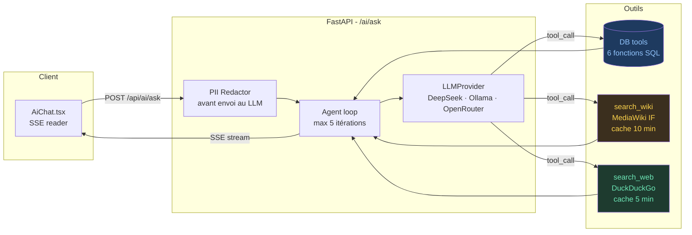
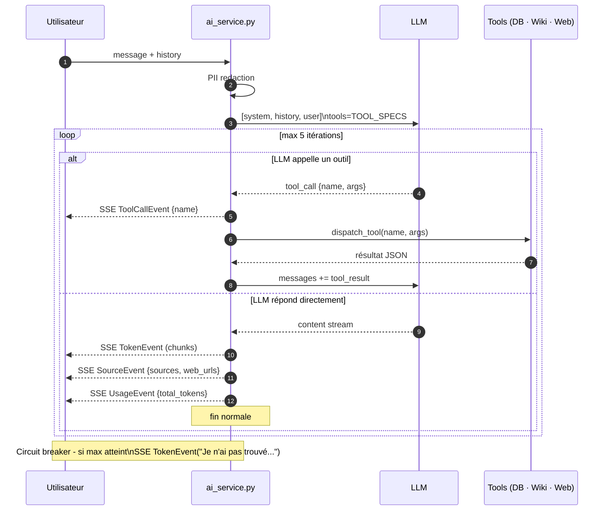
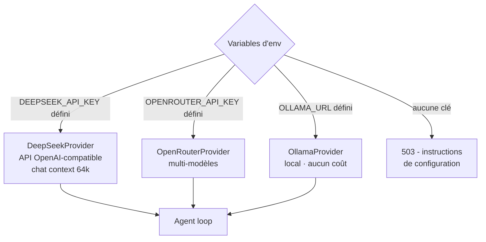

# Architecture IA agentique

L'assistant IA de InfiniDex n'est pas un simple chatbot branché sur un LLM. C'est un **agent tool-calling** qui interroge des sources structurées (DB, wiki IF, DuckDuckGo) avant de synthétiser une réponse, avec refus explicite si aucune donnée fiable n'est trouvée.

## Vue d'ensemble



## Boucle agent



**Fail-closed** : si les 5 itérations s'épuisent sans réponse, ou si le LLM renvoie un contenu vide → message explicite `"Je n'ai pas trouvé cette information."` - jamais d'invention.

## Cascade de retrieval

Le LLM choisit lui-même quels outils appeler. Le system prompt le guide vers cet ordre de priorité :

```mermaid
flowchart TD
    Q([Question utilisateur]) --> LLM1[LLM - itération 1]

    LLM1 -->|tool_call DB| DB["Outils DB\nget_pokemon · get_fusion\nsearch_move · get_item\nget_move_tutors\nsearch_pokemon_locations"]
    DB -->|found: true| RESP([Réponse synthétisée])
    DB -->|found: false| LLM2[LLM - itération 2]

    LLM2 -->|tool_call wiki| WIKI["search_wiki\n(MediaWiki API IF)\ncache TTL 10 min"]
    WIKI -->|found: true| RESP
    WIKI -->|found: false| LLM3[LLM - itération 3]

    LLM3 -->|tool_call web| WEB["search_web\n(DuckDuckGo)\ncache TTL 5 min\nmax 1 500 chars"]
    WEB -->|found: true| RESP
    WEB -->|found: false| FAIL([Fail-closed\n&#34;Je n'ai pas trouvé cette information.&#34;])

    LLM1 -->|no tool_call| RESP
    LLM2 -->|no tool_call| RESP
    LLM3 -->|no tool_call| RESP

    CIRC["⚡ Circuit breaker\nmax 5 itérations"] -.->|stop| FAIL

    style DB   fill:#1e3a5f,color:#93c5fd
    style WIKI fill:#3b2f1e,color:#fcd34d
    style WEB  fill:#1e3b2f,color:#6ee7b7
    style FAIL fill:#3b1e1e,color:#fca5a5
    style CIRC fill:#2d1e3b,color:#c4b5fd
```



## Outils disponibles

| Tool | Source | Paramètres clés | Description |
|------|--------|-----------------|-------------|
| `get_pokemon` | DB | `name` ou `id` | Fiche complète - stats, types, talents, évolutions |
| `get_fusion` | DB | `head_id`, `body_id` | Stats calculés, types, moveset de la fusion |
| `search_move` | DB | `name` (EN ou FR) | Capacité par nom - type, puissance, PP, tuteurs |
| `get_item` | DB | `name` | Item - effet, prix, lieux d'obtention |
| `get_move_tutors` | DB | `move_name` | NPCs qui enseignent la capacité + localisation + prix |
| `search_pokemon_locations` | DB | `condition`, `method` | Pokémon filtrés par lieu/méthode de capture |
| `search_wiki` | Wiki IF | `query` | Page wiki MediaWiki IF - intro + fetch complet si < 300 chars. Cache TTL 10 min |
| `search_web` | DuckDuckGo | `query` | Recherche web généraliste - max 1 500 chars, cache 5 min |

## Couche Privacy / PII

Avant tout envoi au LLM, une passe de redaction supprime les informations personnelles présentes dans les messages ou les résultats d'outils :

```mermaid
flowchart LR
    MSG[Message\nutilisateur] --> RED{PII Redactor}
    RED -->|nom de créateur| RM1["[CREATOR]"]
    RED -->|@ Discord/forum| RM2["[USERNAME]"]
    RED -->|pattern regex PII| RM3["[REDACTED]"]
    RM1 & RM2 & RM3 --> LLM[LLM]
```

La redaction opère en profondeur sur les structures JSON imbriquées (résultats d'outils) - pas seulement sur le message brut.

## Provider pluggable

L'interface `LLMProvider` est abstraite - le provider est sélectionné à l'exécution selon les variables d'environnement :



Ajouter un nouveau provider = implémenter deux méthodes : `complete()` et `stream()`.

## Événements SSE

| Type | Payload | Rendu dans AiChat.tsx |
|------|---------|----------------------|
| `tool_call` | `{name}` | Pastille ⚙ avant la réponse |
| `token` | `{chunk}` | Texte accumulé en streaming dans la bulle |
| `source` | `{sources, web_urls}` | Badges `db` / `wiki` / `web` sous la bulle - web cliquable |
| `usage` | `{total_tokens}` | Compteur tokens sous la bulle |
| `error` | `{message}` | Message d'erreur inline, bulle supprimée |

## Contraintes et performances

| Contrainte | Valeur | Raison |
|------------|--------|--------|
| Max itérations agent | 5 | Évite les boucles infinies |
| Cache wiki TTL | 10 min | Réduit les appels MediaWiki sur questions similaires |
| Cache web TTL | 5 min | DuckDuckGo rate-limit |
| Max chars résultat web | 1 500 | Garde la context window maîtrisée |
| Context window LLM | 64k tokens | DeepSeek chat - suffisant pour history + tools |
| SLA cible | ≤ 6s | Cascade complète DB → wiki → web |

## System prompt

Stocké dans [`backend/prompts/system.md`](https://github.com/benjsant/InfiniDex/blob/main/backend/prompts/system.md) - chargé au démarrage via `pathlib`. Écrit en anglais (meilleure instruction-following), avec règle explicite de répondre en français. Mis à jour sans redéploiement (rechargé au prochain démarrage du conteneur).

## Use-cases cibles

1. **Expliquer une fusion** - "Pourquoi cette fusion a type Feu/Eau ?", "Quels moves synergiques ?"
2. **Recommandations stratégiques** - "Donne une fusion anti-Psy avec Pikachu en head"
3. **Q&A mécaniques IF** - "Comment fonctionnent les Move Experts ?", "Où trouver le Mystic Water ?"

## Références code

- [`backend/services/ai_service.py`](https://github.com/benjsant/InfiniDex/blob/main/backend/services/ai_service.py) - boucle agent + SSE
- [`backend/services/llm_providers.py`](https://github.com/benjsant/InfiniDex/blob/main/backend/services/llm_providers.py) - interface `LLMProvider` + implémentations
- [`backend/services/tools/`](https://github.com/benjsant/InfiniDex/tree/main/backend/services/tools/) - db_tools, wiki_tool, web_tool, dispatch
- [`backend/prompts/system.md`](https://github.com/benjsant/InfiniDex/blob/main/backend/prompts/system.md) - system prompt
- [`frontend/app/ai/page.tsx`](https://github.com/benjsant/InfiniDex/blob/main/frontend/app/ai/page.tsx) - AiChat.tsx avec SSE reader
